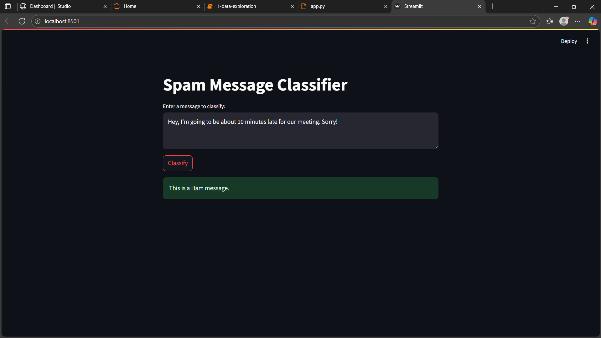
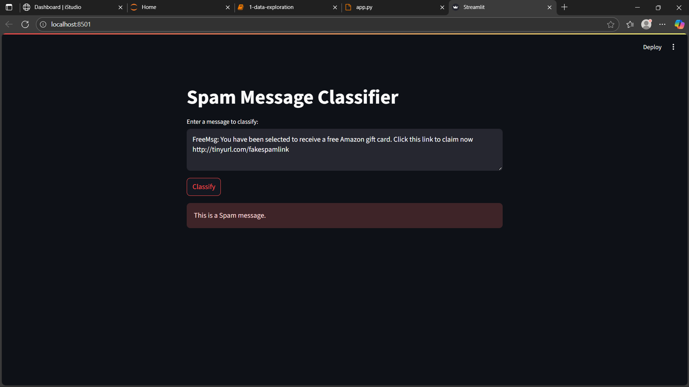

# Spam Message Classifier 🚀

## Overview

This project is an end-to-end machine learning application that classifies SMS messages as either "Spam" or "Ham" (not spam). It uses a Support Vector Machine (SVM) model trained on the UCI SMS Spam Collection dataset and features an interactive web interface built with Streamlit.

---

## Screenshot





---

## Features

- **Data Cleaning & Preprocessing:** Handles raw text data to prepare it for modeling.
- **TF-IDF Vectorization:** Converts text messages into meaningful numerical features.
- **Model Training & Comparison:** Trains and evaluates both Naive Bayes and Support Vector Machine (SVM) models.
- **Interactive UI:** A user-friendly web app built with Streamlit to classify new messages in real-time.
- **Model Persistence:** The trained model and vectorizer are saved using `joblib` for instant predictions.

---

## Performance

The final SVM model achieved the following performance on the held-out test set:

- **Accuracy:** 97.9%
- **Precision:** 97.0%
- **Recall:** 87.3%

---

## How to Run This Project

1.  **Clone the Repository**
    ```bash
    git clone [your-github-repository-link-here]
    ```

2.  **Navigate to the Project Directory**
    ```bash
    cd spam-classifier
    ```

3.  **Install Dependencies**
    ```bash
    pip install -r requirements.txt
    ```

4.  **Run the Streamlit App**
    ```bash
    python -m streamlit run app.py
    ```
    Now, open your web browser and go to `http://localhost:8501`.